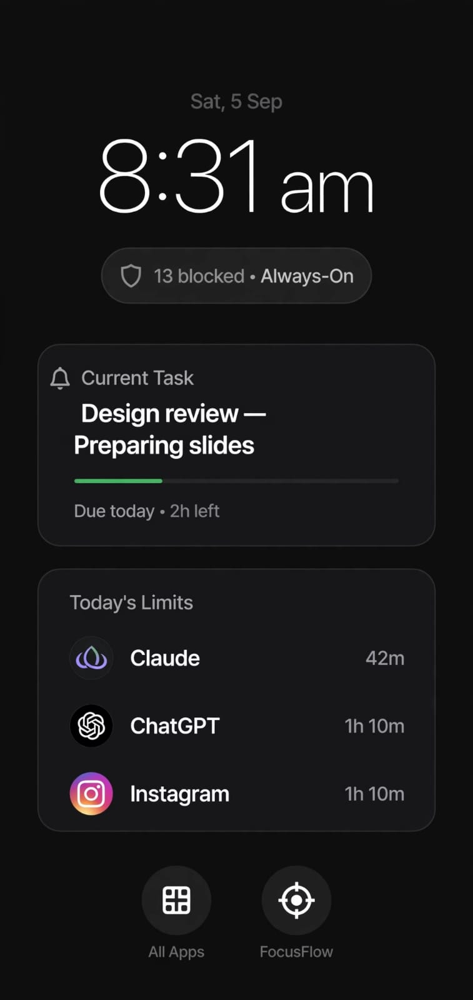
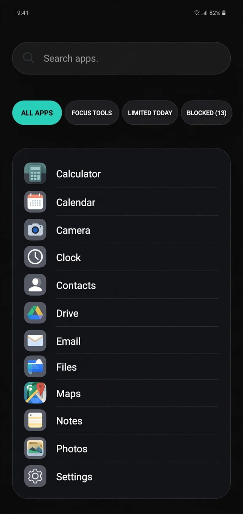

# FocusFlow Classic Launcher — Visual Review

These images are the visual references for the **Classic** launcher theme in
`LAUNCHER_TWO_THEME_PLAN_1788803550916.md`. They are reference material for
layout, hierarchy, density, and visual treatment; the written plan remains the
source of truth for implementation requirements and exact behavior.

## Reference 1 — Classic home screen

**Source upload:** `image_1788803757142.png`

**Maps to the plan:**

- §3 shared home structure
- §4 Classic theme
- §4 terse allowance formatting
- §3 two independent bottom icon targets

**Review cues:**

- The background is flat near-black with no wallpaper or visible texture.
- The date sits above a large, thin, centered digital clock.
- A single muted status pill sits above the Current Task card.
- Current Task and Today's Limits use solid dark cards with subtle borders and
  rounded corners, not frosted blur.
- Today's Limits uses terse right-aligned values such as `42m` and `1h 10m`.
- All Apps and FocusFlow remain separate circular actions with open space
  between them.

## Reference 2 — Classic app drawer

**Source upload:** `image_1788803768706.png`

**Maps to the plan:**

- §6 shared functional filter chips
- §7 Classic drawer list
- §7 compact non-blurred search bar

**Review cues:**

- The drawer keeps the flat black background and avoids the Glassy wallpaper
  treatment.
- The search field is a thin, 44dp-style pill with a subtle border.
- The active `ALL APPS` chip uses the teal accent; other chips are muted.
- Apps appear as a dense vertical list with 36dp-style icons, visible names,
  and divider lines.
- The list is optimized for quick scanning rather than grid customization.

## File mapping

| Purpose | Artifact reference |
|---|---|
| Home screen | `CLASSIC_HOME_SCREEN_REFERENCE.png` |
| App drawer | `CLASSIC_APP_DRAWER_REFERENCE.png` |

The Glassy home, drawer, and editor references are documented in
`GLASSY_LAUNCHER_VISUAL_REVIEW.md`.