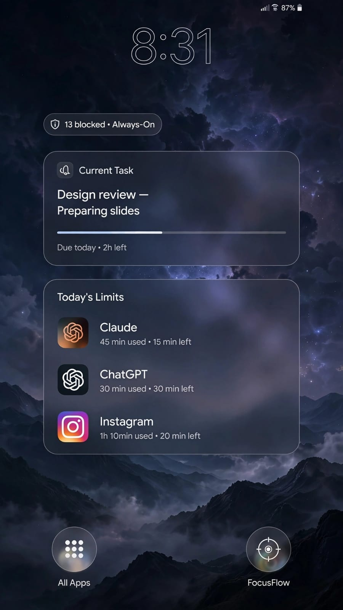
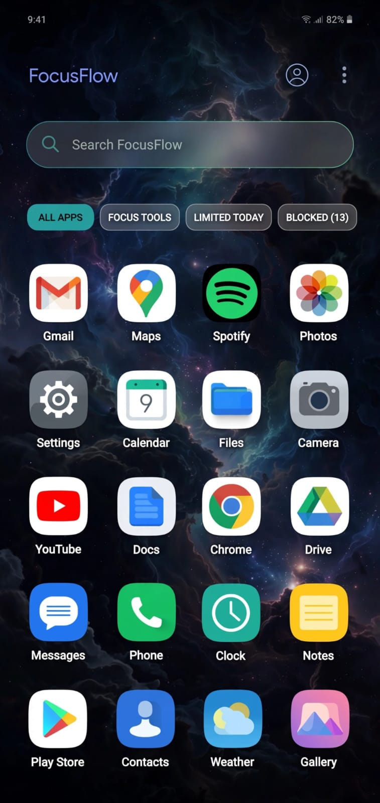
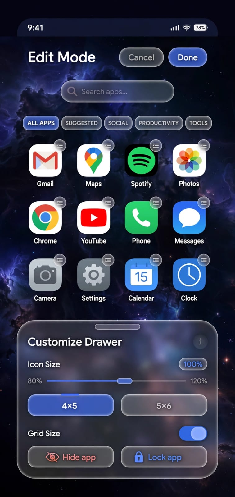

# FocusFlow Glassy Launcher — Visual Review

These images are the visual references for the **Glassy** launcher theme in
`LAUNCHER_TWO_THEME_PLAN_1788803550916.md`. They are reference material for
layout, hierarchy, density, and visual treatment; the written plan remains the
source of truth for implementation requirements and exact behavior.

## Reference 1 — Glassy home screen

**Source upload:** `image_1788803652639.png`

**Maps to the plan:**

- §3 shared home structure
- §5 Glassy theme
- §5 full allowance formatting
- §3 two independent bottom icon targets

**Review cues:**

- Wallpaper remains visible behind the interface.
- The clock, status pill, Current Task card, and Today's Limits card form a
  clear vertical reading order.
- Cards use translucent/frosted surfaces rather than a shared bottom capsule.
- The two bottom actions are separate circular targets with visible wallpaper
  between them.

## Reference 2 — Glassy app drawer

**Source upload:** `image_1788803663448.png`

**Maps to the plan:**

- §6 shared functional filter chips
- §8 Glassy drawer grid
- §8 compact search and spacing

**Review cues:**

- Search, filter chips, and the four-column icon grid are visually distinct
  layers.
- The active filter is clearly filled while inactive filters remain outlined or
  muted.
- The glass search field and chip treatments preserve the wallpaper context.
- App labels remain visible beneath the icons.

## Reference 3 — Glassy app editor

**Source upload:** `image_1788803674531.png`

**Maps to the plan:**

- §8 dedicated Glassy Edit Mode
- §8 drag-handle badges
- §8 Customize Drawer sheet
- §8 icon scale, grid size, hide, and lock actions

**Review cues:**

- Edit Mode is a distinct full-drawer state with `Cancel` and `Done`.
- Every icon exposes a small drag affordance without turning each icon into a
  separate popup.
- The Customize Drawer sheet is a frosted surface anchored over the drawer.
- Grid-size selection, icon scaling, Hide app, and Lock app are grouped into
  one customization surface.

## File mapping

| Purpose | Artifact reference |
|---|---|
| Home screen | `GLASSY_HOME_SCREEN_REFERENCE.png` |
| App drawer | `GLASSY_APP_DRAWER_REFERENCE.png` |
| App editor | `GLASSY_APP_EDITOR_REFERENCE.png` |

Classic-theme references are documented separately in
`CLASSIC_LAUNCHER_VISUAL_REVIEW.md`.